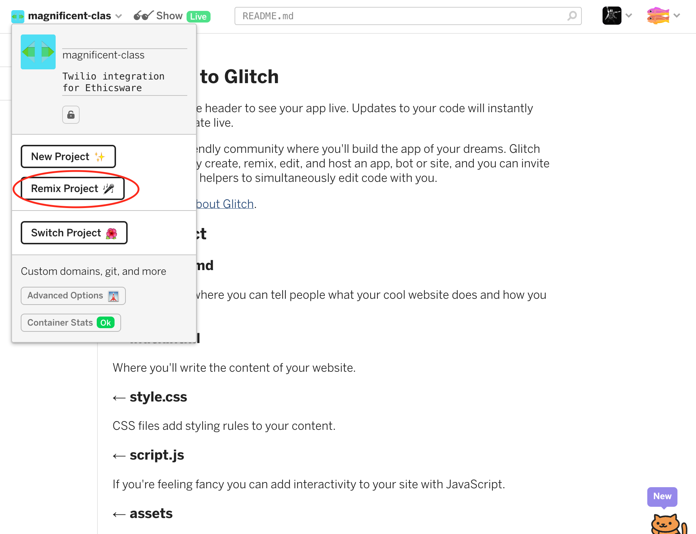
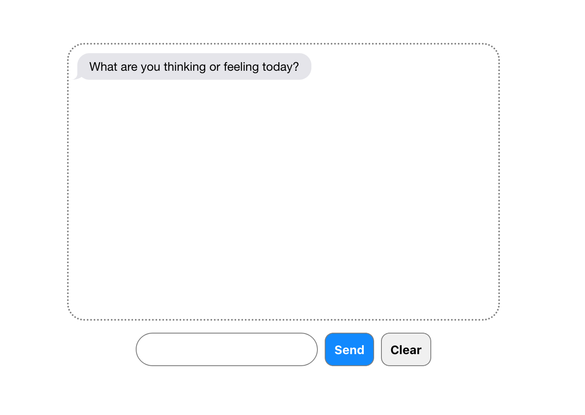
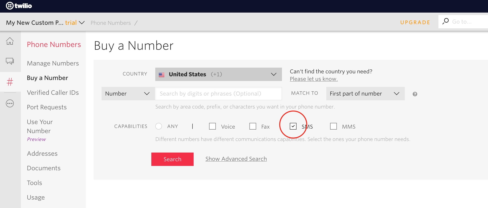
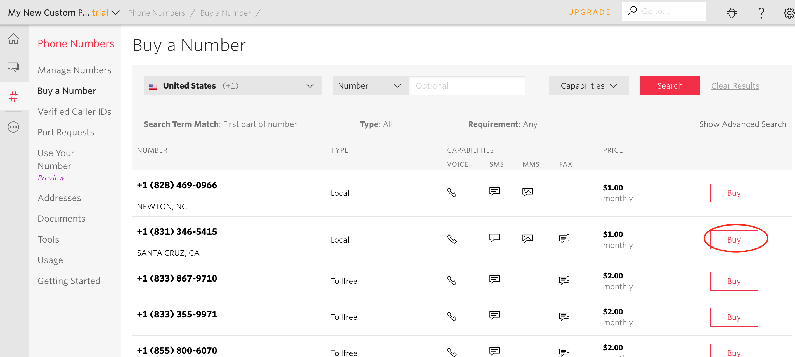
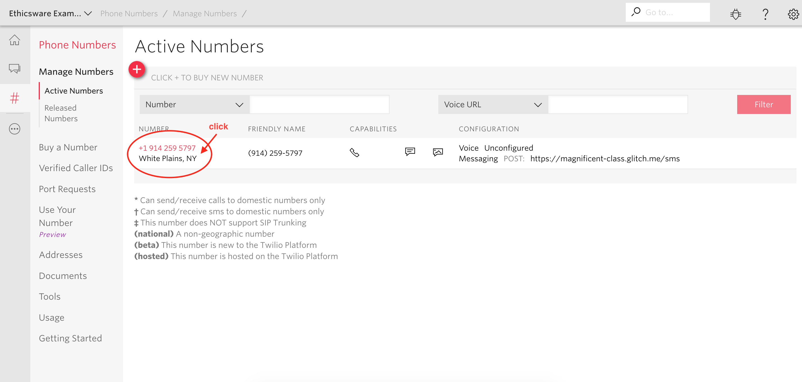
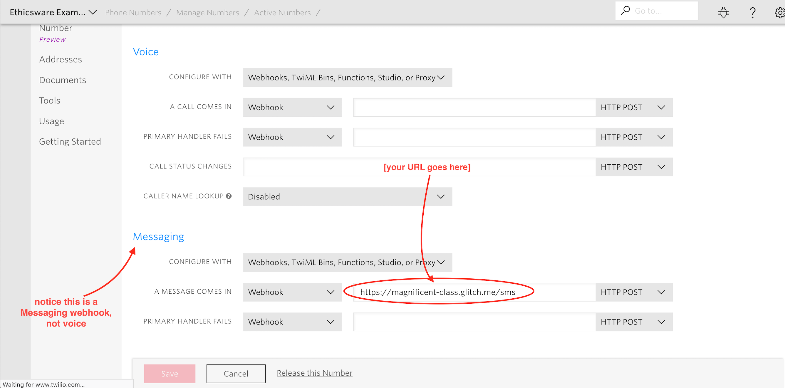

Twilio integration for Ethicsware
=======================================

This lets you use your ethicsware project over text message, so you can text back and forth with a number!

This uses the Twilio API. 

(As a note, this API costs $. There is a free trial. 
It is relatively inexpensive - $1/month for a phone number, and $0.0047 to send and receive one text message. So if you send and receive 100 text messages/mo, it will cost $1.47/mo.)

## How this works

Twilio is an API that helps us respond to SMS (text) messages. Through Twilio, we can rent a specific phone number and use it for our own usage. Let's say that phone number is `+1-(212)-555-1234`.

Twilio has the ability to define "incoming webhooks". This means: every time `+1-(212)-555-1234` receives a text message from somebody, Twilio will trigger an HTTP request with the text message as arguments.

This code creates a web server that receives this requests and processes it to find the text message that was sent. 

Then, this webserver, using our code, will create a response to the text message, and send it back.

## Step-by-step instructions:

### Glitch:
- Create an account at https://glitch.com.
- Remix (Copy) [this glitch example](https://glitch.com/edit/#!/magnificent-class)

- You should now have a new URL, like `superb-owl.glitch.com`, or such. Click on `show` (with the glasses) to preview it!

### Twilio:
- Sign up for an account
- Start a project at this URL: https://www.twilio.com/console/projects/create
  - Start a 'Programmable SMS' project.
- After creating a project, buy a phone number at [this link](https://www.twilio.com/console/phone-numbers/search).
  - Search for a number that has SMS enabled, and click buy.
  
  
- Great! Now your number should be linked with your project.
- Now go to this page to set the incoming webhook: https://www.twilio.com/console/phone-numbers/incoming
  - Click on your phone number:
  
  - And set the webhook.
  
 
  The webhook should end in /sms. If you're using Glitch, then it should be something like `https://magnificent-class.glitch.com/sms`.
  
  
- Follow this tutorial: https://www.twilio.com/docs/sms/quickstart/python
  - Buy a number
  - 
